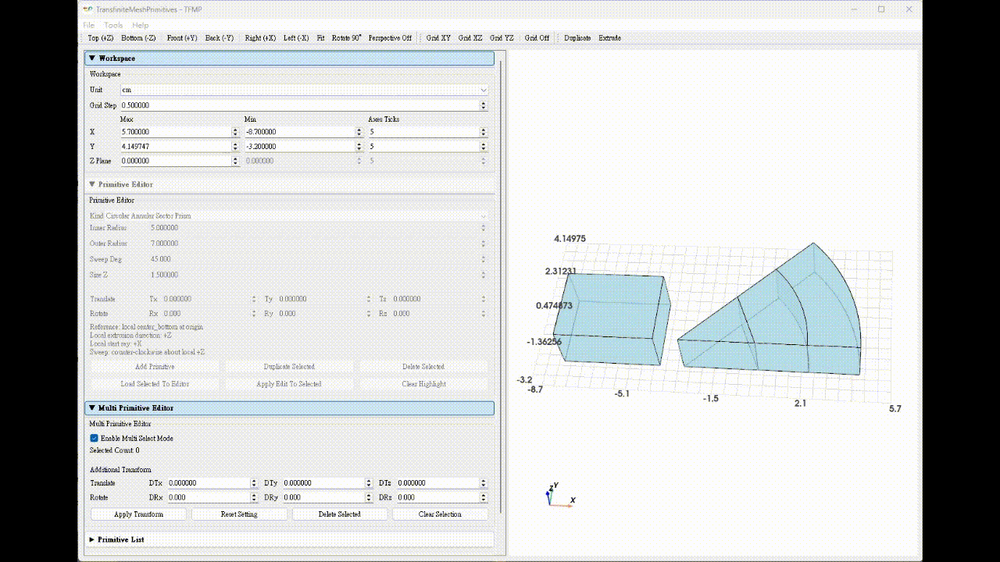

# TransfiniteMeshPrimitives (TFMP) — demo

Visual demo for authoring template-based 3D primitives for simulation-oriented modeling and <a href="https://gmsh.info/">Gmsh</a> GEO workflows, featuring editable geometry construction, face attachment, transfinite mesh control, physical groups, and GEO export.

  

  <a href="#overview">Overview</a> •
  <a href="#why-tfmp">Why TFMP?</a> •
  <a href="#featured-interactions">Featured Interactions</a> •
  <a href="#examples">Examples</a> •
  <a href="#repository-scope">Repository Scope</a>

---

## Overview

TFMP is a visual authoring tool concept for constructing structured 3D geometry from predefined primitive templates and preparing Gmsh-compatible GEO descriptions for simulation-oriented device modeling workflows. It supports interactive geometry construction workflows such as face attachment, face-based extrusion, and primitive duplication.

Directly writing Gmsh GEO scripts is flexible, but it can become less convenient when structured 3D geometry must be built, edited, rearranged, and kept consistent across transfinite settings, physical groups, and entity IDs.

This repository is presented as a **demo showcase** of the interface and workflow design only.

  

  Short animated workflow preview. Loading may take a few seconds on GitHub.

---

## Why TFMP?

- Build structured 3D geometry from reusable primitive templates instead of rewriting repeated GEO blocks by hand
- Edit dimensions, placement, and rotation through an interactive UI instead of repeatedly modifying GEO scripts
- Duplicate primitives to quickly reuse geometry parameters
- Attach primitives through face-to-face matching instead of manual alignment
- Create geometry through face-based extrusion from selected primitive faces
- Preview the constructed geometry with workspace grid and labels
- Organize physical groups for point, line, surface, and volume entities before export
- Configure edge-wise transfinite mesh settings, including node count, distribution mode, and ratio control
- Save project settings for later editing
- Export Gmsh-compatible GEO files with consistent entity IDs and primitive-overlap warnings

---

## Featured Interactions

### Face attachment

Attach one primitive face to another through a face-matching workflow for structured geometry assembly.

  

### Face-based extrusion

Create structured geometry by extruding selected primitive faces along a specified direction and length.

  

### Primitive duplication

Duplicate existing primitives to quickly reuse geometry parameters and continue editing from the copied primitive.

  

---

## Examples

This section presents representative device examples created in TFMP for simulation-oriented workflows, with each figure showing a direct comparison between the TFMP-authored geometry and the corresponding downstream result in Gmsh.

### Example 1. MOSFET structure

A structured device example showing how TFMP can be used to build and organize MOSFET-like geometry for downstream Gmsh GEO-based workflows.

  

  TFMP-authored geometry and its downstream result in Gmsh.

### Example 2. Ring resonator structure

A curved-geometry example showing how sector-based primitive templates can be used to construct ring-resonator-like structures and pass them into Gmsh workflows.

  

  TFMP-authored geometry and its downstream result in Gmsh.

---

## Repository Scope

This repository is intended for:

- Visual demonstration
- UI/UX presentation
- Workflow explanation
- Feature showcase

It is a demo-only repository and does **not** provide:

- Source code
- Executable binaries
- Packaged releases

---

**Author:** Xi-Jun Fang
