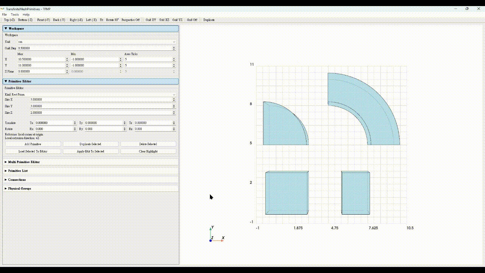
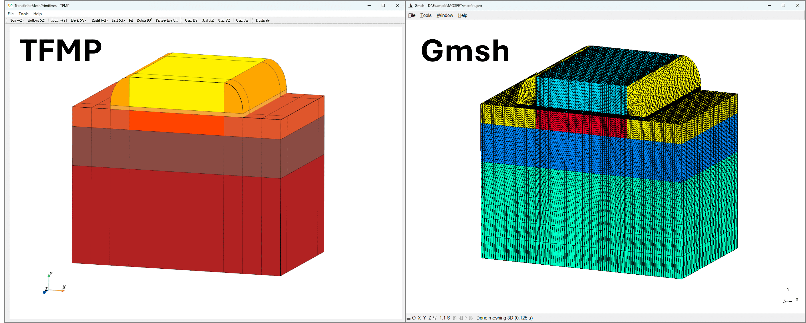
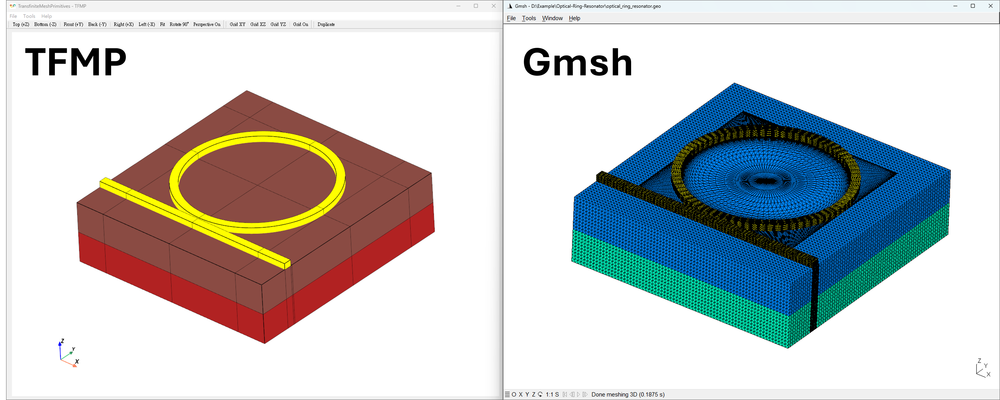

# TransfiniteMeshPrimitives (TFMP) — demo

  Visual demo for authoring template-based 3D primitives for Gmsh GEO workflows, featuring editable geometry construction, face attachment, transfinite mesh control, physical groups, and GEO export.

  

  <a href="#overview">Overview</a> •
  <a href="#highlights">Highlights</a> •
  <a href="#featured-interaction">Featured Interaction</a> •
  <a href="#examples">Examples</a> •
  <a href="#repository-scope">Repository Scope</a> •
  <a href="#contact">Contact</a>

---

## Overview

TFMP is a visual authoring tool concept for constructing structured 3D geometry from predefined primitive templates and preparing Gmsh-compatible GEO descriptions for downstream meshing workflows.

Instead of editing Gmsh GEO scripts directly, TFMP focuses on template-based primitive authoring, editable UI-driven geometry construction, face-based assembly, transfinite-oriented mesh control, physical-group preparation, and consistent global ID handling before GEO export.

This repository is presented as a **demo showcase** of the interface and workflow design only.

---

## Highlights

- Template-based authoring of structured 3D primitives
- Primitive library including rectangular prisms, triangular prisms, sector-based shapes, and annular-sector variants
- Editable UI for dimensions, placement, and rotation instead of direct GEO scripting
- Face-to-face attachment workflow for structured geometry assembly
- Edge-wise mesh settings for transfinite meshing workflows, including node count, distribution mode, and ratio control
- Physical-group assignment for point, line, surface, and volume entities
- Consistent geometry preparation and global ID organization for downstream Gmsh GEO export
- 3D preview with geometry labels and workspace grid

---

## Featured Interaction

### Face attachment

Attach one primitive face to another through a face-matching workflow for structured geometry composition.

  

---

## Examples

This section presents representative device-oriented examples created in TFMP, with each figure showing a direct comparison between the TFMP-authored geometry and the corresponding downstream result in [Gmsh](https://gmsh.info/).

### Example 1. MOSFET structure

A structured device example showing how TFMP can be used to build and organize MOSFET-like geometry for downstream Gmsh GEO-based workflows.

  

  TFMP-authored geometry and its downstream result in Gmsh.

### Example 2. Ring resonator structure

A curved-geometry example showing how sector-based primitive templates can be used to construct ring-resonator-like structures and pass them into Gmsh workflows.

  

  TFMP-authored geometry and its downstream result in Gmsh.

---

## Repository Scope

This repository is intended for:

- Visual demonstration
- UI/UX presentation
- Workflow explanation
- Feature showcase

It is a demo-only repository and does **not** provide:

- Source code
- Executable binaries
- Packaged releases

---

## Contact

**Xi-Jun Fang**  
Email: fangmbf552688@gmail.com
